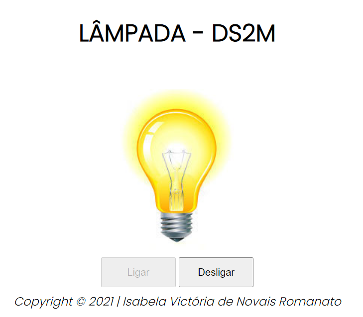

## LÂMPADA - DS2M

Projeto craido com objetivo didático para as aulas de **PWFE** do curso de Desenvolvimento de Sistemas do [SENAI JANDIRA](https://jandira.sp.senai.br/), sobre orientação do professor [Fernando Leonid](https://github.com/fernandoleonid). 

O projeto consiste em criar uma lâmpada que tenha três ações:

* Ligar 💛
* Desligar  🤍
* Quebrar 💔

Todo o código foi construído seguindo as boas práticas, como responsabilidade única e funções puras.

